# Backoffice

## Macroprocesso

<figure>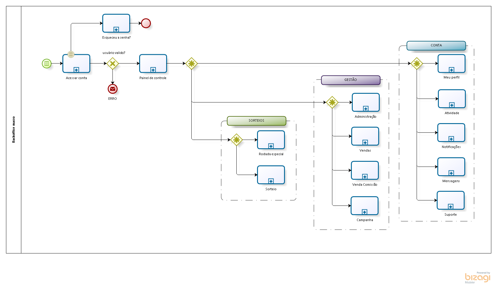<figcaption></figcaption></figure>

O Backoffice é o local onde o administrador tem acesso aos gerenciamentos disponíveis. Ao entrar no Backoffice, o usuário terá acesso aos paineis de controle (Dashboards), e encontrará as seguintes opções de gerenciamento disponivéis:

* Dashboard
  * Dashboard vendas
  * Dashboard analítico
* Gestão
  * Administração
    * Usuários
    * Vendedores
  * Vendas
    * Etapas
    * Imagens
    * Clientes
    * Vendas
  * Comissão
  * Campanha
* Sorteios
  * Rodada especial
  * Sorteio
* Conta
  * Meu perfil
  * Atividade
  * Notificações
  * Mensagens
  * Suporte

## Painel de controle

<figure><figcaption></figcaption></figure>

Com os painéis de controle, o usuário poderá ter uma visão geral e administrativa da plataforma, tanto da parte de vendas, tendo o controle da receita, quanto da parte analitica, tendo o controle dos dados dos usuários.

## Gestão

### Administração

<figure>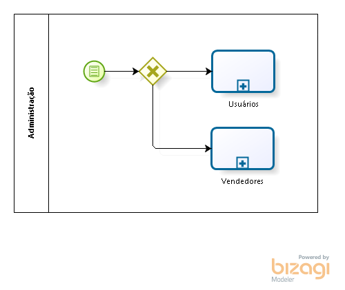<figcaption></figcaption></figure>

#### Usuários

<figure><figcaption></figcaption></figure>

Nesta área, o usuário administrador poderá cadastrar usuários que terão acesso ao Backoffice, alem de poder editar e remover usuários cadastrados.

#### Vendedores

<figure>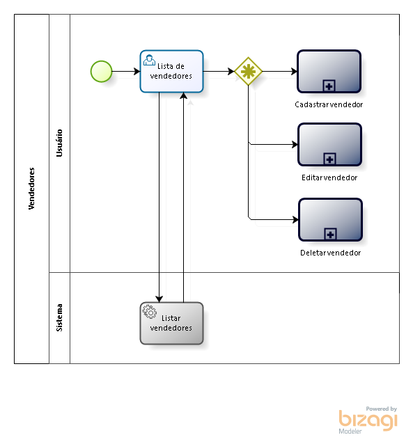<figcaption></figcaption></figure>

Nesta área, o usuário administrador poderá cadastrar vendedores, alem de poder editar e remover vendedores cadastrados.

### Vendas

<figure>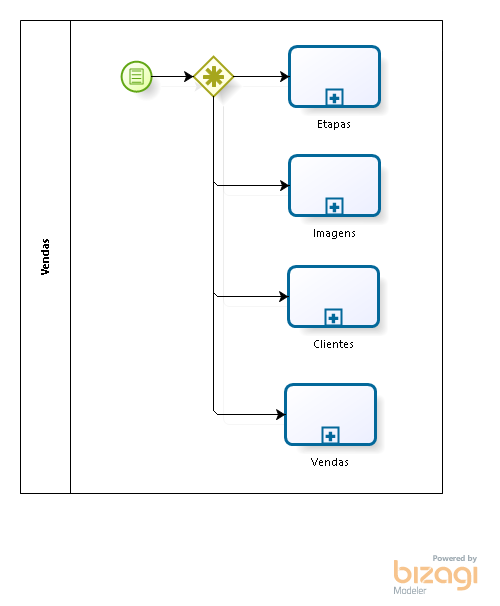<figcaption></figcaption></figure>

#### Etapas

<figure><figcaption></figcaption></figure>

Nesta área, o usuário administrador poderá cadastrar etapas, alem de poder editar e remover etapas já cadastradas.

#### Imagens

<figure>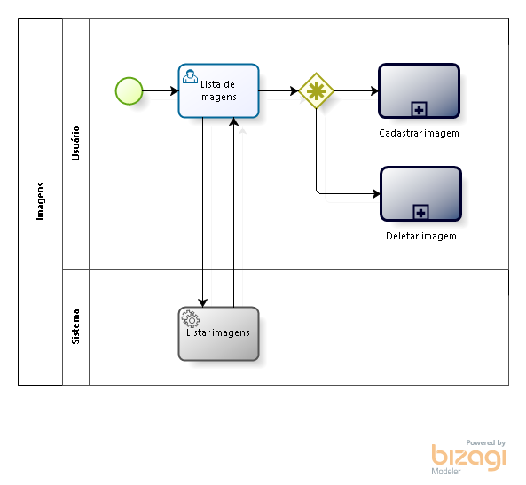<figcaption></figcaption></figure>

Nesta área, o usuário administrador poderá cadastrar imagens, alem de poder remover imagens já cadastradas.

#### Clientes

<figure>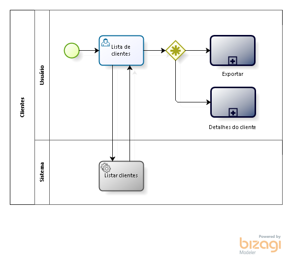<figcaption></figcaption></figure>

Nesta áre, o usuário administrador poderá visualizar a lista de clientes do Mundo da Sorte, tendo a opção de exportar os dados em formato de planilha de todos ou de um unico cliente.

#### Vendas

<figure><figcaption></figcaption></figure>

Nesta áre, o usuário administrador poderá visualizar a lista de vendas do Mundo da Sorte, quem foram os compradores, o valor, data e horario das vendas.

### Comissão

<figure>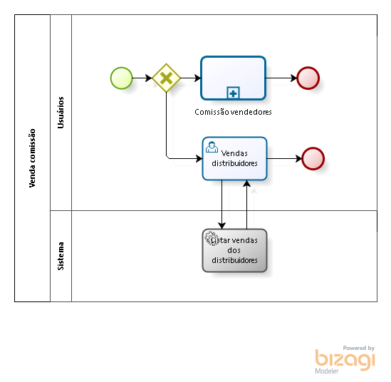<figcaption></figcaption></figure>

Nesta áre, o usuário administrador poderá visualizar a lista de vendas do Mundo da Sorte, quem foram os compradores, o valor, data e horario das vendas.

### Campanha

<figure><figcaption></figcaption></figure>

Nesta área, o usuário administrador poderá cadastrar campanhas, alem de poder editar e remover campanhas já cadastradas.

## Sorteios

Nesta área, o usuário administrador poderá visualizar um calendario com as datas dos sorteios do Mundo da Sorte.

## Conta

### Meu perfil

<figure>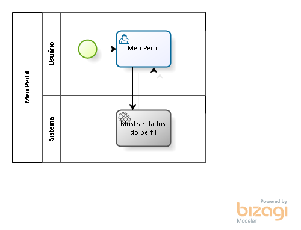<figcaption></figcaption></figure>

Nesta área, o usuário administrador poderá visualizar o próprio perfil do backoffice.

### Atividades

<figure>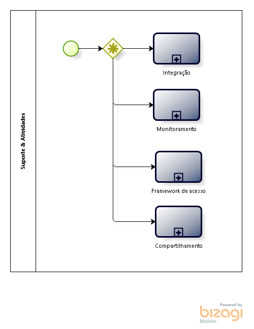<figcaption></figcaption></figure>

#### Integração


Em desenvolvimento.


#### Monitoramento


Em desenvolvimento.


#### Framework de acesso


Em desenvolvimento.


#### Compartilhamento


Em desenvolvimento.


### Notificações

<figure>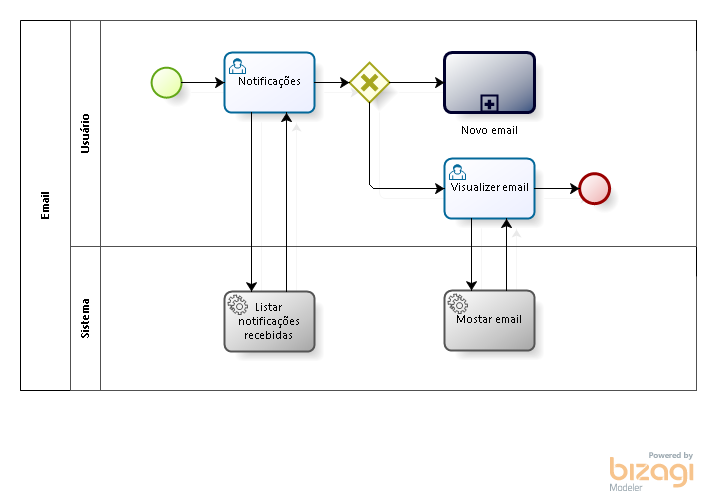<figcaption></figcaption></figure>

Nesta área, o usuário administrador poderá visualizar as notificações recebidas, alem de ver os detalhes de cada uma e responde-las através de emails.

### Mensagem

<figure>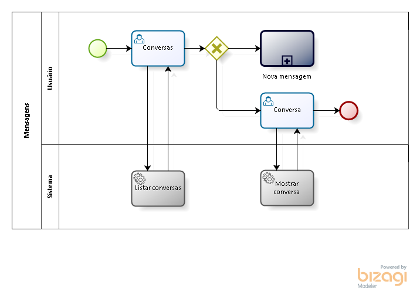<figcaption></figcaption></figure>

Nesta área, o usuário administrador poderá visualizar as conversas abertas, podendo enviar novas mensagens.

### Suporte


Em desenvolvimento.

