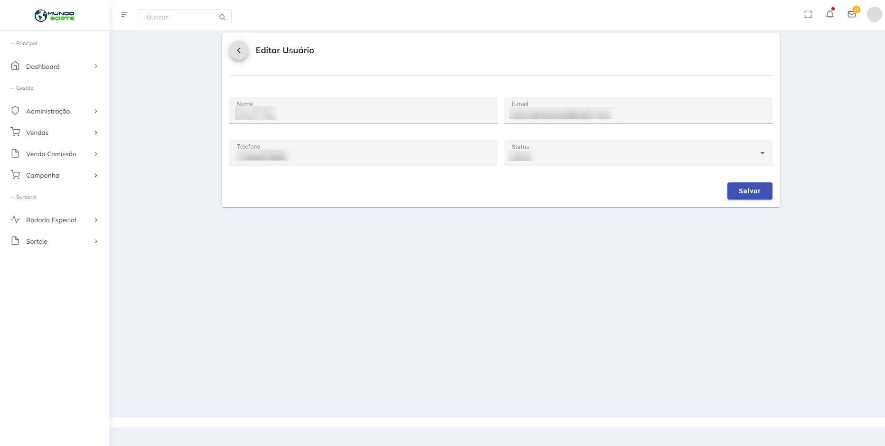

# Gerenciar usuários

### Acessar lista de usuários administrativos

* Acesse o menu e clique em `Administração`.
  * O menu será expandido.
* Clique em `Usuários`.

<figure><figcaption></figcaption></figure>

### Editar usuários administrativos

* Selecione um usuário e clique no ícone de lapis.
  * O sistema irá abrir uma página com as informações do usuário.
* Insira os novos dados e clique em `Salvar`.

<figure><figcaption></figcaption></figure>

### Registrar usuários administrativos

* Clique em `Novo usuário`.
* Insira os dados e clique em `Salvar`.

<figure><figcaption></figcaption></figure>

### Excluir usuários administrativos

* Selecione um usuário e clique no ícone de lixeira.
  * O sistema irá abrir um modal de confirmação.
* Clique em `Excluir`.
  * O sistema irá remover o usuário e ele não poderá mais operar.
